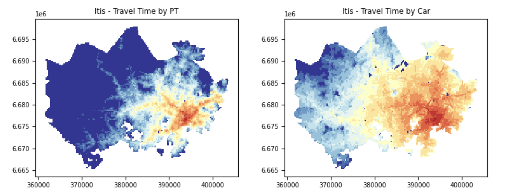
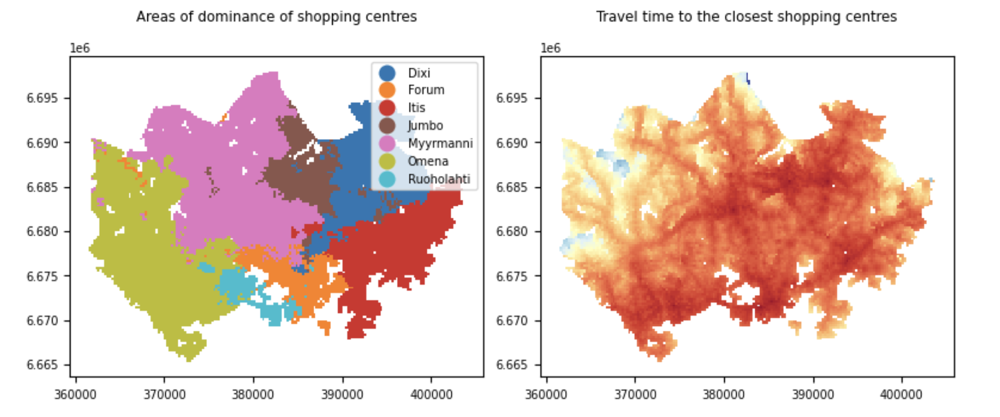

# Data Aggregation and Map Classification
<i>Exercise 4 of Automating GIS Process 2023</i> 

## Overview
The goal of this project is to visualise the travel time from every place of the metropolitan area to seven major shopping centres of Helsinki, Finland. It can act as the first step to determine good locations for housing in the city.

  
  

The project composes of several steps:
1. merge spatial data with non-spatial data
2. apply choropleth map classification and plot the graphs
3. compute the closest shopping mall and the minimum travel time for each location
4. plot the areas of dominance shopping centres and the minimum travel time

## Software and Libaries
- Python 3.9
- NumPy
- Pandas
- Geopandas
- Mapclassify
- Jupyter Notebook

## Related Projects
- Project 1: <a href="https://github.com/hcheung-dev/creating-and-storing-geometries">creating-and-storing-geometries</a>
- Project 2: <a href="https://github.com/hcheung-dev/spatial-analysis-with-geopandas">spatial-analysis-with-geopandas</a>
- Project 3: <a href="https://github.com/hcheung-dev/population-around-shopping-centres">population-around-shopping-centres</a>
